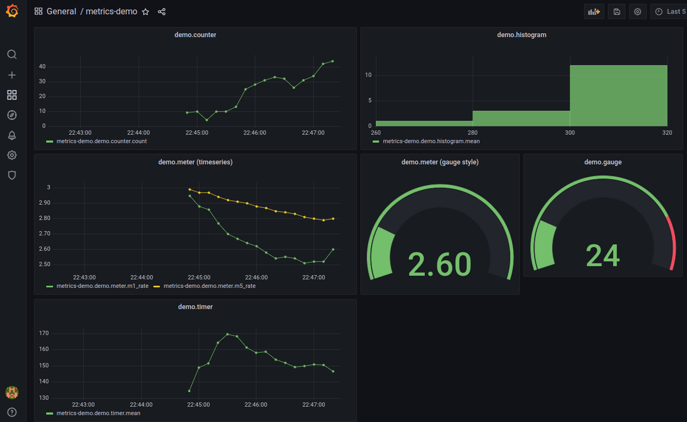

# Metrics Stack - Dockerized

Add metrics to your own application easily, using this dockerized stack.

This stack has:

- grafana
- graphite
- and a sample Java application using [metrics](https://metrics.dropwizard.io/4.2.0/) library

## Getting Started

Get this repo first.

Start the monitoring stack as follows

```bash
$   cd  metrics-in-docker

$   ./start.sh
```

Go to Grafana URL : [localhost:3000](http://localhost:3000)

Login with username 'admin' and password 'admin'

Skip the prompt to change the default password.

## Running the Sample App in Eclipse

There is a sample project under `sample-app-java` directory.

Import this project in Eclipse.

Inspect file : `src/main/java/com/elephantscale/metrics_demo/MyMetricsRegistry.java`

Make sure the graphite hosts is 'localhost'

```java
public final static String GRAPHITE_HOST = "localhost";
```

And run the class : `com.elephantscale.MyMetricsDemo`

You will see metrics being printed on console.

In Grafana, 

* Go to 'Dashboard' section
* And open 'metrics-demo' dashboard

You will something like this!




## Running the Sample App in a Docker Container

Don't have a  Java Dev environment?  Don't worry, use our `java-dev` docker.

Start the `java-dev` container

```bash
$   cd  metrics-docker
$   ./start-java-dev.sh
```


A few things to note:

* We run the container as `CURRENT_USER`.  This makes sure that all artifacts created have proper permissions by current user.
* Also we mount `$HOME/.m2` directory into `/var/maven/.m2` directory in container.  This allows maven to reuse downloaded artifacts.  This will hugely speed up compiles

This will drop you into the container.

Before running, inspect file : `src/main/java/com/elephantscale/metrics_demo/MyMetricsRegistry.java`

Make sure the graphite hosts is 'localhost'

```java
public final static String GRAPHITE_HOST = "graphite";
```

```bash
# in container

$   cd sample-java-app
$   mvn clean  package
```